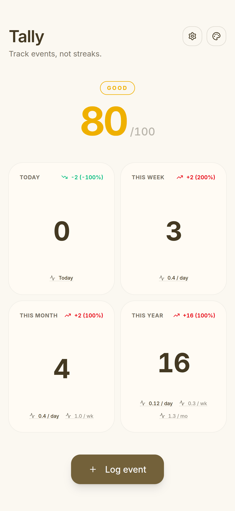
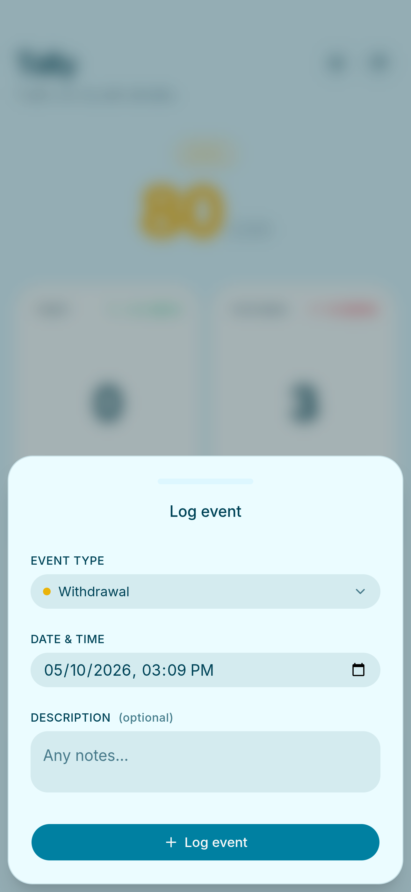
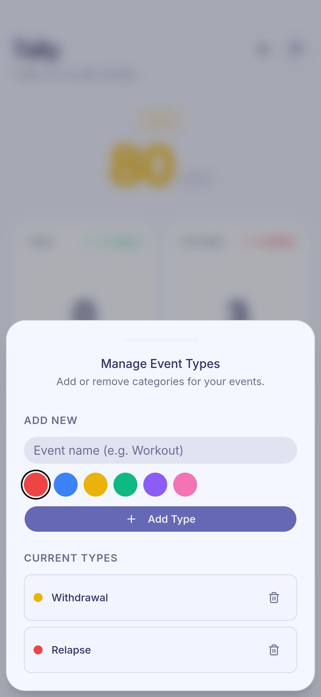
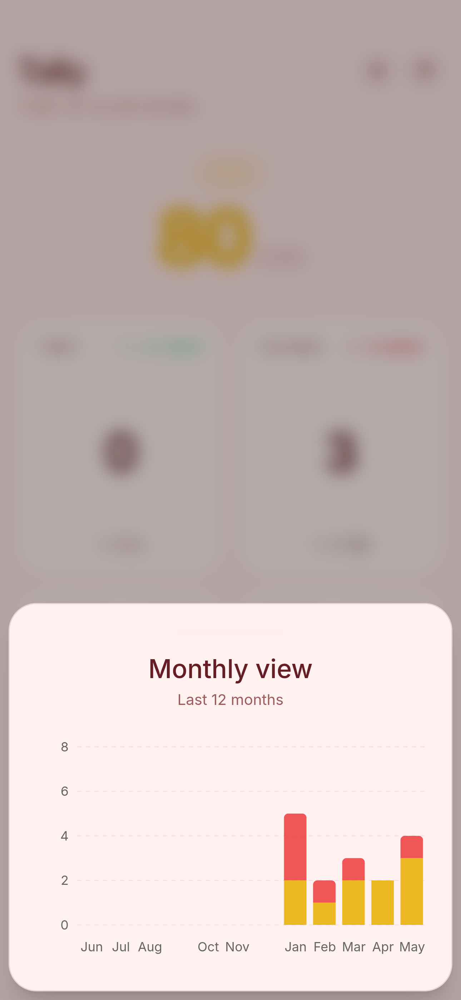
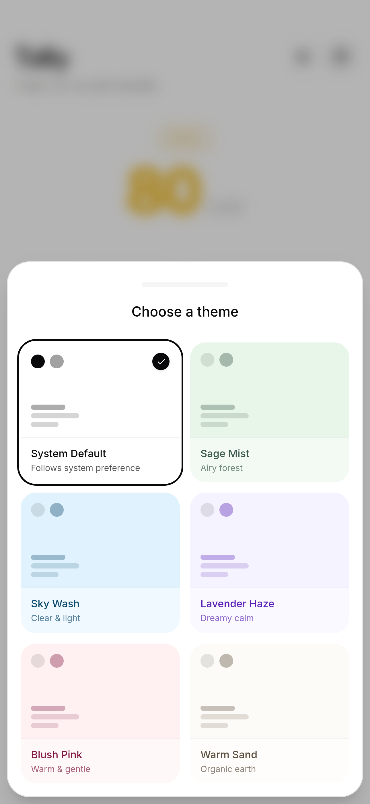

# Tally

Track events, not streaks. A minimalist habit tracker built to help you monitor patterns without the pressure of maintaining gamified streaks.

## Screenshots

<div align="center">
  
  
  
  
  
</div>

## Features

- Event Tracking: Log specific events with custom types and colors. Define what matters to you, whether it's a relapse, a workout, or a simple check-in.

- Visual Analytics: View your data through interactive charts that break down trends by day, week, month, or year.

- Health Score: A unified score (0-100) calculated from your daily rate. It focuses on your current velocity rather than long-term averages.

- Custom Themes: 5 pastel themes (Sage Mist, Sky Wash, Lavender Haze, Blush Pink, Warm Sand) built using CSS variables and next-themes for instant switching.

- Local Storage: Your data stays in your browser. No account or sign-up required.

- PWA Support: Install it on your phone for a native app experience.

## Tech Stack

- React 19 & TypeScript
- Vite
- Zustand (with persistence)
- Tailwind CSS V4
- shadcn/ui
- next-themes

## Logic & Calculations

### Health Score

The score calculates your "running average" across different timeframes (Week, Month, Year). It gives more weight to recent behavior to reflect your current pace accurately.

- 100: Perfect (0 events)
- 80-99: Excellent
- 50-79: Good
- 0-49: Critical

### Rates

The app displays rates (per day, per week, per month) based on the time elapsed in the current period. This helps you visualize the intensity of your current habits immediately.

## Contributing

### Installation

1. Clone the repository

   ```bash
   git clone https://github.com/yourusername/tally.git
   cd tally
   ```

2. Install dependencies

   ```bash
   pnpm install
   ```

3. Start the development server

   ```bash
   pnpm dev
   ```

4. Open [http://localhost:5173](http://localhost:5173) to view the app.

### Themes

Themes are defined via CSS classes in `globals.css`. To add a new theme, define a new class (e.g., `.theme-midnight`) with the necessary CSS variables (`--background`, `--foreground`, etc.) and add it to the `THEMES` array in `configs.ts`.
